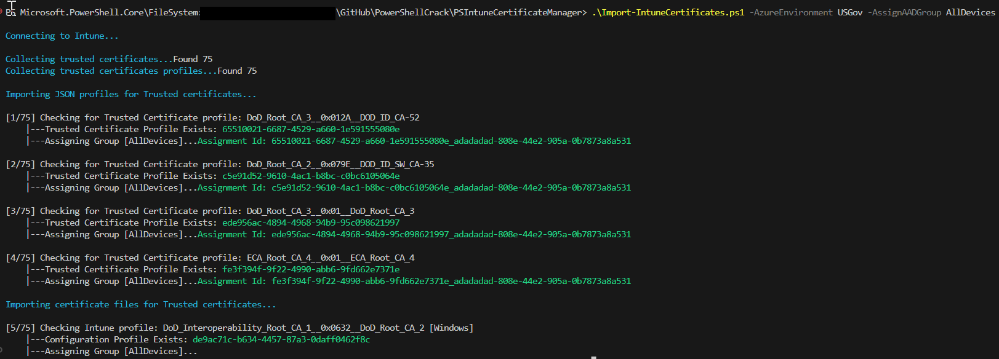

# Intune Certificate Manager Scripts
A couple of PowerShell scripts to manage multiple certificates within Intune. 

## Why use this?
If you have ever loaded a chain of certificates for large organizations, you will find it very time consuming importing every root and intermediate certs into Intune. 
The next problem is there is no way of knowing which certificates is expired and is no longer needed. 

I developed this to resolve both of those issues.

## What it does

There are two script and I will give an explanation to each of them
- **Import-IntuneCertificates.ps1** - This will import 3 types of certificates (root, intermediate, and user) into their appropriate certificate store. The script will parse cer files within the folders plus JSON files exported from other Intune environment. 
- **Remove-IntuneCertificates.ps1** - This will remove certificates based on expiration. It will export the cert and view it to determine if it expired. 

## Screenshots

## Supported platforms

- Windows
- iOS
- MacOS
- Android ASOP
- Android Admin
- Android Enterprise

## Supported Azure Environments

- Public (Commercial and GCC)
- USGov (GCCH/IL4)

## Not Tested but available

- USGovDoD (GCCH/IL5)

## Import Options

- **AzureEnvironment** - Options are: _Public, USGov_. USDod is an option but not tested.  Defaults to _Public_
- **PlatformType** - Options are: _Windows, iOS, MacOS, AndroidASOP, AndroidAdmin, AndroidEnterprise_. Defaults to _Windows_
- **AssignPolicySet** - NOT READY. Provide the Policy Set or ID to assign the certificates to. 
- **AssignAADGroup** - NOT READY. Provide the Azure AD Group or ID to assign each certificate to. If policy set is specified it will check for that assignment as well. 
- **JSONOnly** - Switch. Only imports JSON files in the JSON folder. Ignores any cer file in the Root, Intermediate, and User folders
- **IncludeExpired** - Switch. Imports certificates that are expired as well. Any JSON that doesn't have the populated description with _Expires:_ will import

## Remove Options

- **AzureEnvironment** - Options are: _Public, USGov_. USDod is an option but not tested. Defaults to _Public_
- **PlatformType** - Options are: _Windows, iOS, MacOS, AndroidASOP, AndroidAdmin, AndroidEnterprise_. Defaults to _Windows_
- **Exclude** - Specify what certs to exclude. String can include regex pipe for multiple (eg. RootCA1|RootCA2)
- **JustAssignments** - NOT READY. Switch. Only removes assignment from target
- **All** - Switch. Removes all certificates based on platform

## Additional options:
 
 - the **-WhatIf** command is supported and allows for testing prior to import or removal. 
 - the **-Verbose** is also supported and will output additional details...however the output may not be cleanly displayed. 

# Notes/Issues

- Currently assignments are not working or ready. These will be coming shortly
- Any JSON that doesn't have the populated description with _Expires:_ will import

# DISCLAIMER
This Sample Code is provided for the purpose of illustration only and is not
intended to be used in a production environment.  **THIS SAMPLE CODE AND ANY
RELATED INFORMATION ARE PROVIDED "AS IS" WITHOUT WARRANTY OF ANY KIND, EITHER
EXPRESSED OR IMPLIED, INCLUDING BUT NOT LIMITED TO THE IMPLIED WARRANTIES OF
MERCHANTABILITY AND/OR FITNESS FOR A PARTICULAR PURPOSE**.  We grant You a
nonexclusive, royalty-free right to use and modify the Sample Code and to
reproduce and distribute the object code form of the Sample Code, provided
that You agree: (i) to not use Our name, logo, or trademarks to market Your
software product in which the Sample Code is embedded; (ii) to include a valid
copyright notice on Your software product in which the Sample Code is embedded;
and (iii) to indemnify, hold harmless, and defend Us and Our suppliers from and
against any claims or lawsuits, including attorneys’ fees, that arise or result
from the use or distribution of the Sample Code.

This posting is provided "AS IS" with no warranties, and confers no rights. Use
of included script samples are subject to the terms specified
at https://www.microsoft.com/en-us/legal/copyright.
